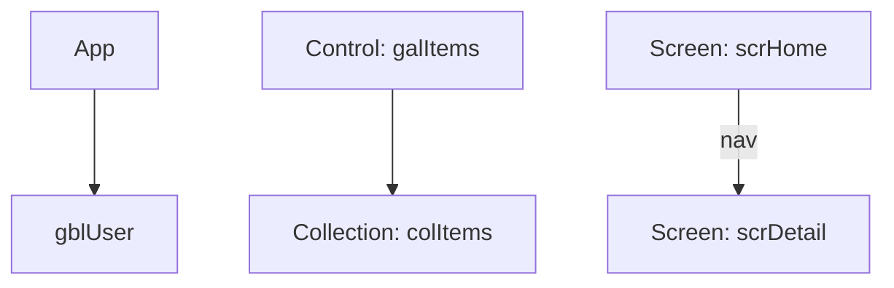

# Example output

Real output from pacheck run against the bundled fixtures.

## lint (console)

```text
$ pacheck lint ./ComponentApp
Src/App.pa.yaml
  3:14    warning PA1003 Variable 'gblApiKey' is assigned but never read.
  3:14    warning PA1006 App.OnStart is heavy (7 assignments, 18 nodes).
  3:14    error   PA2001 Looks like an API key: AK…LE (len 20)
  3:14    error   PA2003 URL contains embedded credentials: ht…v1 (len 40)
Src/scrOrders.pa.yaml
  2:11    warning PA1001 Filter over 'Orders' may not delegate (non-delegable function in the query).
  8:13    warning PA1002 ForAll performs a per-row data operation (N+1 pattern).
  ...     info    PA1012 Formula repeated 3 times (scrOrders/lblDup1.Text, …).
  ...     info    PA1013 Control 'Label' appears at 2 versions: 2.4.0, 2.5.1.
  ...     error   PF0001 Could not parse formula: ...
```

Secret values are always **redacted** — `AK…LE (len 20)` — in every format.

## lint (json)

```json
{
  "schemaVersion": "1.0",
  "tool": "pacheck",
  "version": "0.1.0",
  "summary": { "error": 3, "warning": 8, "info": 4, "total": 15 },
  "findings": [
    {
      "ruleId": "PA1003", "ruleName": "unused-variable",
      "category": "Maintainability", "severity": "warning",
      "message": "Variable 'gblApiKey' is assigned but never read.",
      "file": "Src/App.pa.yaml", "line": 3, "column": 14,
      "elementPath": "App.OnStart", "fingerprint": "…"
    }
  ]
}
```

## lint (sarif)

Uploads to GitHub code scanning; findings appear inline on the PR. Each result carries a
`partialFingerprints["pacheck/v1"]` so scanning can track it across commits.

## stats

```text
$ pacheck stats ./MyApp
╭────────────────────────┬──────────────────╮
│ Metric                 │            Value │
├────────────────────────┼──────────────────┤
│ Screens                │                2 │
│ Controls               │                6 │
│ Collections            │                2 │
│ Formulas               │               17 │
│ Max formula complexity │ 21 (App.OnStart) │
╰────────────────────────┴──────────────────╯
```

## analyze --graph mermaid



## diff (markdown, for a PR comment)

```markdown
## pacheck diff
**0** added · **1** removed · **1** renamed · **0** moved · **1** property changes

| Change | Element | Name | Detail |
|---|---|---|---|
| Removed | TextInput | `txtSearch` | from scrHome |
| Renamed | Button | `btnGo → btnOpen` | probable rename (100% property match) |
| PropertyChanged | Property | `lblTitle.Text` | -ref AppTitle |
```
