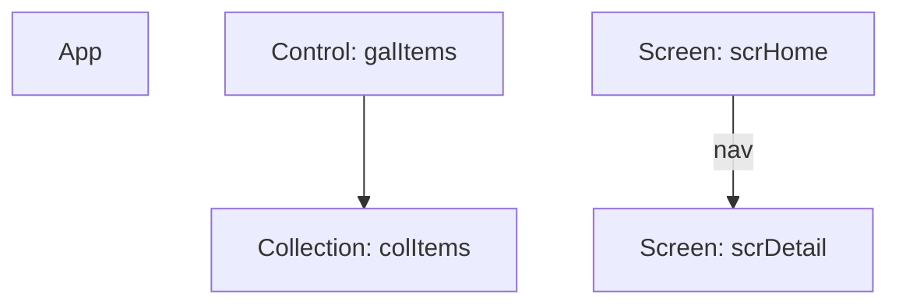

# Usage guide

Complete reference for every `easel` command, its options, and worked examples.

- [Install & first run](#install--first-run)
- [Inputs](#inputs)
- [`doctor`](#doctor)
- [`lint`](#lint)
- [`stats`](#stats)
- [`analyze`](#analyze)
- [`secrets`](#secrets)
- [`diff`](#diff)
- [`rename`](#rename-preview)
- [`explain` / `fix`](#explain--fix-opt-in-ai)
- [Configuration](#configuration)
- [Baseline](#baseline)
- [Exit codes](#exit-codes)
- [In CI](#in-ci)

---

## Install & first run

```bash
dotnet tool install --global Microsoft.PowerApps.CLI.Tool   # pac (only for .msapp / .zip inputs)
dotnet tool install --global EaselCli                       # easel
easel doctor                                                # check the environment
```

The command is `easel` (the NuGet package is `EaselCli`). Everything except `rename` is
**read-only** — no command ever modifies your input.

Get help for any command:

```bash
easel --help
easel lint --help
```

## Inputs

Every analysis command takes a `<path>` that is one of:

| Input | What happens |
|---|---|
| **Unpacked source folder** | `*.pa.yaml` read directly (Git integration / `pac canvas unpack` output). No `pac` needed. |
| **`.msapp` file** | `easel` calls `pac canvas unpack` into a temp folder, analyses it, cleans up. Needs `pac`. |
| **Solution `.zip`** | `easel` extracts it, finds the canvas `.msapp`, unpacks it. Needs `pac`. Multiple apps → it lists them so you pass one directly. |

`--keep-temp` keeps the temp unpack folder (for debugging) instead of deleting it.

---

## doctor

Environment diagnostics — run this first.

```bash
easel doctor
```

```text
╭─────────────────┬────────┬───────────────────────────────────────╮
│ Check           │ Status │ Detail                                  │
├─────────────────┼────────┼───────────────────────────────────────┤
│ easel           │ ok     │ easel 0.1.4                             │
│ pac CLI         │ ok     │ 2.6.4 (~/.dotnet/tools/pac)             │
│ Power Fx parser │ ok     │ Microsoft.PowerFx.Core                  │
│ pa.yaml schema  │ ok     │ supported: v3.0                         │
│ temp writable   │ ok     │ /var/folders/.../T/                     │
╰─────────────────┴────────┴───────────────────────────────────────╯
Environment ready.
```

Exit `0` when ready, `3` if `pac` is missing/outdated.

---

## lint

Run the rule set and report findings.

```bash
easel lint <path> [options]
```

| Option | Default | Meaning |
|---|---|---|
| `-f, --format` | `console` | `console` \| `json` \| `sarif` \| `html` |
| `--fail-on` | `warning` | Minimum severity that makes the run exit `1`: `info` \| `warning` \| `error` |
| `--config` | *(search up)* | Path to a `.easel.yml` |
| `-o, --output` | *(stdout)* | Write machine output (json/sarif/html) to a file |
| `--write-baseline` | | Record current findings as the baseline and exit `0` |
| `--baseline` | `.easel-baseline.json` | Baseline file to compare against |
| `--keep-temp` | | Keep the temp unpack folder |

**Console:**

```bash
easel lint ./MyApp
```

```text
Src/scrHome.pa.yaml
  23:9    warning PA1009 Interactive control 'btnNoLabel' (Button) has no AccessibleLabel.
          Set AccessibleLabel so screen readers can announce this control.
  27:23   info    PA1010 'If' nested 3 deep (threshold 2).
Src/App.pa.yaml
  3:14    warning PA1003 Variable 'gblUnused' is assigned but never read.

3 findings — 2 warnings, 1 info
```

**JSON** (stable, versioned — for CI):

```bash
easel lint ./MyApp --format json -o easel.json
```

```json
{
  "schemaVersion": "1.0",
  "tool": "easel",
  "version": "0.1.4",
  "summary": { "error": 0, "warning": 2, "info": 1, "total": 3 },
  "findings": [
    {
      "ruleId": "PA1003", "ruleName": "unused-variable",
      "category": "Maintainability", "severity": "warning",
      "message": "Variable 'gblUnused' is assigned but never read.",
      "file": "Src/App.pa.yaml", "line": 3, "column": 14,
      "elementPath": "App.OnStart", "fingerprint": "9926e31bfd255bee"
    }
  ]
}
```

**SARIF** (GitHub code scanning) and **HTML** (offline report for clients):

```bash
easel lint ./MyApp --format sarif -o easel.sarif
easel lint ./MyApp --format html  -o easel-report.html
```

**Gate strictly / loosely:**

```bash
easel lint ./MyApp --fail-on error     # only errors fail the build
easel lint ./MyApp --fail-on info      # anything fails the build
```

**Analyse a packaged app or a whole solution:**

```bash
easel lint MyApp.msapp
easel lint "20250826_solution.zip"
```

---

## stats

Metrics about the app.

```bash
easel stats <path> [-f console|json] [-o <file>] [--keep-temp]
```

```bash
easel stats ./MyApp
```

```text
╭────────────────────────┬───────────────────────────────╮
│ Metric                 │                         Value │
├────────────────────────┼───────────────────────────────┤
│ Screens                │                             2 │
│ Controls               │                           269 │
│ Components             │                             1 │
│ Data sources           │                            14 │
│ Media assets           │                   1 (37.2 KB) │
│ Global variables       │                            12 │
│ Collections            │                             5 │
│ Formulas               │                          2566 │
│ Max formula complexity │ 199 (Homepage/Gallery1.Items) │
╰────────────────────────┴───────────────────────────────╯
```

`--format json` emits the same numbers plus a per-screen breakdown for dashboards.

---

## analyze

Query the symbol table and dependency graph. Pick one mode.

```bash
easel analyze <path> (--find <sym> | --dead-code | --impact <sym> | --graph mermaid|dot) [-o <file>]
```

**Find every definition and use of a symbol:**

```bash
easel analyze ./MyApp --find gblUser
```

```text
gblUser
  def GlobalVariable @ Src/App.pa.yaml:3:14 (App.OnStart)
  use Src/scrHome.pa.yaml:27:23 in scrHome/btnNoLabel.OnSelect
1 definition(s), 1 usage(s)
```

**Dead code** — unused variables/collections/media and orphaned screens:

```bash
easel analyze ./MyApp --dead-code
```

```text
Unused variables (1)
  • gblUnused
Unused collections (1)
  • colOrphan
Unused media (1)
  • logo.png
3 dead-code item(s)
```

**Impact** — everything that transitively depends on a symbol (blast radius before you change it):

```bash
easel analyze ./MyApp --impact colItems
```

```text
Impact of colItems — 3 dependent element(s):
  App: App
  Control: btnNoLabel
  Control: galItems
```

**Graph export** — Mermaid or Graphviz DOT:

```bash
easel analyze ./MyApp --graph mermaid -o graph.mmd
easel analyze ./MyApp --graph dot | dot -Tsvg -o graph.svg
```



---

## secrets

Scan string literals for hardcoded secrets (regex + Shannon entropy) and inventory data
sources for DLP review. Values are always **redacted**.

```bash
easel secrets <path> [-f console|json] [--config <file>] [--fail-on-secret] [-o <file>]
```

```bash
easel secrets ./MyApp
```

```text
Src/App.pa.yaml
  3:14    error   PA2001 Looks like an API key: AK…LE (len 20)
  3:14    error   PA2003 URL contains embedded credentials: ht…v1 (len 40)

2 findings — 2 errors

Data source inventory (DLP)
╭─────────┬────────────╮
│ Name    │ Type       │
├─────────┼────────────┤
│ Orders  │ SharePoint │
╰─────────┴────────────╯
```

- `--fail-on-secret` exits `1` if anything is found (gate a pipeline).
- Allowlist known-safe strings in `.easel.yml` under `hardcoded-secret.allowlist`.

---

## diff

Semantic comparison of two app versions (folders, `.msapp`, or `.zip`).

```bash
easel diff <base> <head> [-f console|markdown|json] [-o <file>]
```

```bash
easel diff ./v1 ./v2
```

```text
- removed  TextInput txtSearch (from scrHome)
~ renamed  Button btnGo → btnOpen (probable rename (100% property match))
* changed  Property lblTitle.Text (-ref AppTitle)
0 added, 1 removed, 1 renamed, 0 moved, 1 property change(s)
```

- Detects **Added / Removed / Renamed / Moved / PropertyChanged**.
- Renames are inferred by control type + property similarity.
- Property changes are described at **AST level** (which functions/refs changed), not as a
  text diff.
- `--format markdown -o diff.md` produces a table ideal for a PR comment.

---

## rename (preview)

Rename a symbol across an app and repack it. **Input must be a `.msapp`.**

```bash
easel rename <msapp> --from <old> --to <new> [-o <out.msapp>] [--keep-temp]
```

```bash
easel rename MyApp.msapp --from gblUsr --to gblCurrentUser
```

```text
Unpacking via pac…
Packing via pac…
✓ Renamed 'gblUsr' → 'gblCurrentUser'. (7 occurrence(s) in 4 file(s))
→ MyApp.renamed.msapp
preview: open the new .msapp in Power Apps Studio and verify before shipping.
```

- The input is **never modified**; output is `<name>.renamed.msapp` beside it (or `--output`).
- **Collision check:** if `--to` already exists, the rename is refused (exit `2`).
- **String-literal warning:** if the old name also appears inside a `"..."` literal, easel
  warns — review those in Studio.
- Marked **preview** — always verify the result in Power Apps Studio.

---

## explain / fix (opt-in AI)

Optional helpers over the deterministic results. **Nothing leaves your machine unless you
pass `--send`** — the default prints the exact prompt that *would* be sent.

```bash
easel explain <path> --rule <id> [--send --endpoint <url> --model <id> --api-key-env <VAR>]
easel fix     <path> --rule <id> [--send --endpoint <url> --model <id>]
```

**Dry run (no network):**

```bash
easel explain ./MyApp --rule PA1009
```

```text
provider: dry-run
— dry run: no data left this machine —
The prompt that WOULD be sent:
  [system] You are a senior Power Apps engineer...
  [user]   Rule PA1009 (missing-accessible-label)...
```

**Actually call a provider** (OpenAI-compatible — a local LM Studio/Ollama endpoint keeps
data local, or a hosted API):

```bash
export EASEL_AI_KEY=sk-...
easel explain ./MyApp --rule PA1009 --send \
  --endpoint https://api.openai.com/v1/chat/completions --model gpt-4o-mini
```

`fix` suggests a corrected formula as a diff and **validates it by re-parsing** — it never
auto-applies. See [ai.md](ai.md).

---

## Configuration

`.easel.yml` at your repo root (searched upward). Full reference:
[configuration.md](configuration.md).

```yaml
rules:
  screen-control-limit: { max: 300 }
  deep-nested-if: { threshold: 2 }
  naming-convention:            # opt-in: silent unless patterns are set
    severity: warning
    patterns:
      variable: "^(gbl|var|loc)[A-Z]"
      collection: "^col[A-Z]"
      screen: "^scr[A-Z]"
      control: "^(btn|lbl|txt|gal)[A-Z]"
  unused-media: off             # disable a rule
  hardcoded-secret:
    allowlist: ["https://contoso.example.com"]

ignore:
  - "**/Legacy*.pa.yaml"

output: { format: console }
```

## Baseline

Adopt easel on a legacy app without drowning in existing findings:

```bash
easel lint ./MyApp --write-baseline    # record today's findings to .easel-baseline.json
git add .easel-baseline.json
easel lint ./MyApp                      # from now on, only NEW findings are reported
```

Fingerprints are line-independent, so unrelated edits above a finding don't un-baseline it.

## Exit codes

| Code | Meaning |
|---|---|
| 0 | OK |
| 1 | Findings at/above `--fail-on` (or a secret with `--fail-on-secret`) |
| 2 | Input error (bad path, pre-YAML format, rename collision) |
| 3 | pac missing or incompatible |
| 4 | Internal error |

## In CI

Bundled GitHub Action (installs `pac` + `easel`, runs lint, uploads SARIF):

```yaml
- uses: lukoplt/easel/action@v0
  with:
    path: ./src/MyApp
    format: sarif
    fail-on: warning
- uses: github/codeql-action/upload-sarif@v3
  with: { sarif_file: easel.sarif }
```

Any CI via the tool:

```bash
dotnet tool install --global EaselCli
easel lint ./src/MyApp --format sarif -o easel.sarif --fail-on warning
```

See [ci.md](ci.md) for the full workflow, including posting a `diff` as a PR comment.
